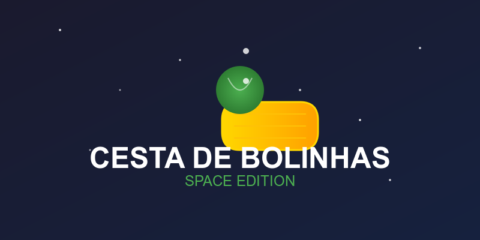
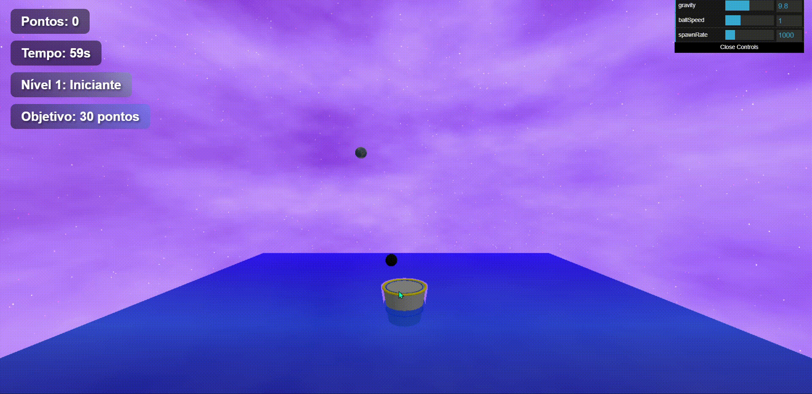

# 🎮 Cesta de Bolinhas

<div align="center">



[](https://www.javascript.com/)
[](https://threejs.org/)
[](https://github.com/schteppe/cannon.js)


---

Um jogo 3D envolvente onde você controla uma cesta espacial e captura bolinhas que caem do cosmos. Desenvolvido com tecnologias modernas de renderização 3D e física realista.

</div>

## ✨ Demonstração

<div align="center">



</div>

## 🎯 Características Principais

### 🌟 Gráficos e Física
- **Renderização 3D Avançada** com Three.js
- **Física Realista** powered by Cannon.js
- **Efeitos Visuais Impressionantes**
  - Partículas dinâmicas
  - Confetes celebrativos
  - Fundo espacial animado
  - Iluminação dinâmica

### 🎲 Gameplay
- **5 Níveis Progressivos**
- **Sistema de Pontuação Elaborado**
- **Bolinhas Especiais** com efeitos únicos
- **Obstáculos Dinâmicos**
- **Desafios Crescentes**

## 🚀 Instalação

1. **Clone o repositório**
   ```bash
   git clone https://github.com/seu-usuario/cesta-de-bolinhas.git
   ```

2. **Entre no diretório**
   ```bash
   cd cesta-de-bolinhas
   ```

3. **Inicie um servidor local**
   ```bash
   # Usando Python
   python -m http.server 8000
   
   # Ou usando Node.js
   npx http-server
   ```

4. **Acesse o jogo**
   ```
   http://localhost:8000
   ```

## 💡 Como Jogar

### 🎮 Controles
- **Mouse**: Movimenta a cesta
- **Clique**: Inicia o jogo

### 📈 Progressão
1. **Nível 1 - Iniciante**
   - Familiarize-se com os controles
   - Objetivo: 30 pontos
   - Tempo: 60 segundos

2. **Nível 2 - Intermediário**
   - Introdução aos obstáculos
   - Objetivo: 50 pontos
   - Tempo: 50 segundos

3. **Nível 3 - Avançado**
   - Desafios com vento
   - Objetivo: 80 pontos
   - Tempo: 45 segundos

4. **Nível 4 - Profissional**
   - Obstáculos móveis
   - Objetivo: 100 pontos
   - Tempo: 40 segundos

5. **Nível 5 - Mestre**
   - Todos os desafios combinados
   - Objetivo: 150 pontos
   - Tempo: 30 segundos

## 🛠️ Tecnologias

<div align="center">

| Tecnologia | Uso |
|------------|-----|
| Three.js | Renderização 3D |
| Cannon.js | Motor de Física |
| JavaScript | Lógica do Jogo |
| HTML | Estrutura |
| CSS | Estilização |

</div>

## 📦 Dependências

- **Three.js**: Motor de renderização 3D
- **Cannon.js**: Simulação de física
- **dat.GUI**: Interface de debug

---

<div align="center">

[⬆ Voltar ao topo](#-cesta-de-bolinhas)

</div> 
